# Non-nested Multi fidelity gaussian Processes and surrogates
This repo is all about implementing a Non-Nested Multy Fidelity Gaussian Process (NN-MF-GP) togeter with an improved Efficient Global Optimization (EGO) algorithm based on the article "A Non-Nested Infilling Srategy for Multi-Fidelity Efficient Global Optimisation" by Sacher et al. (2021). It is a first approach to developping a fully fonctionning framework for Fluid Dynamics computations acceleration. Nevertheless the current state of the project is general enough to be applicable to any appropriate case scenario where the cost of computation is the main decision factor. The current document explains the structure of the repo and the structure of the code with step by step guide for its usage.

# 📁 Multifidelity-GP-Clean - Project Structure

## Quick Overview at the directory structure```

```
Multifidelity-GP-Clean/  
├──  **.gitignore**
├── charts/
│   └── 🖼️ relations.png
├── example/
│   ├── hartmann_6d/
│   │   ├── convergence_plot.png
│   │   ├── ego_backup.json
│   │   ├── hartmann_6d.py
│   │   ├── Hartmann6d.py
│   │   ├── logfile.log
│   │   └── response_surface_2d.png
│   └── hydrofoil_optim/
│   │   ├── convergence_plot.png
│   │   ├── ego_backup.json
│   │   ├── hydrofoil_optim.py
│   │   ├── logfile.log
│   │   ├── optim_neuralfoil.py
│   │   └── response_surface_2d.png
├── 📂legacy/
│   ├── legacy_nested/
|   |   └── ...
│   └── legacy_non_nested/
│   │   └── ...
├── 📂 mfego/                   \# Project's main source code
│   ├── convergence_plot.png
│   ├── ego_backup.json
│   ├── logfile.log
│   ├── main.py
│   ├── response_1d.png
│   └── 📁 src/
│   │   ├── 📄 acquisition.py
│   │   ├── 📄 data_management.py
│   │   ├── 📄 kernels.py
│   │   ├── 📄 optimizer.py
│   │   ├── 📄 simulator.py
│   │   ├── 📄 surrogate_models.py
│   │   └── 📄 visualization.py
├── 📖 **README.md**
├── 📂 sandbox/
│   └── 📄 gaussian_process_singlefidelity_sandbox.ipynb

The programm is object oriented (POO) with multiple classes and a hierarchy being the basis of the gaussian process and the EGO algorithm.

