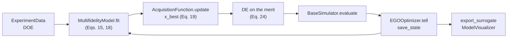

# Non-nested Multi fidelity Gaussian Processes and surrogates

This repo is all about implementing a Non-Nested Multi Fidelity Gaussian Process (NN-MF-GP) together with an improved Efficient Global Optimization (EGO) algorithm based on the article "A Non-Nested Infilling Strategy for Multi-Fidelity based Efficient Global Optimization" by Sacher et al. (2021) (`references/multifidelity_opt.pdf`). The recursive multi-fidelity formulation comes from the PhD thesis of L. Le Gratiet (2013) (`references/Multi_fidelity_Gaussian_process_regressi.pdf`). It is a first approach to developing a fully functioning framework for Fluid Dynamics computations acceleration.

Nevertheless the current state of the project is general enough to be applicable to any appropriate case scenario where the cost of computation is the main decision factor.

The current document explains the structure of the repo and the structure of the code with step by step guide for its usage.

> A complete theoretical / numerical review of the code (with the list of all the fixes, their origin and their effect) is available in [`analysis/RAPPORT_ANALYSE.md`](analysis/RAPPORT_ANALYSE.md). Every modified place of the code is tagged with a `# [FIX-<ID>]` comment referring to that report. The initial code is kept in `legacy/legacy_mfego_initial/`.

## 📦 Installation & Dependencies

To run the framework and the examples, you need **Python 3.10+** (tested with Python 3.13; the core framework also runs with Python 3.14) and the following modules (see `requirements.txt`).

**Core Mathematical Engine:**

* `numpy` (>= 1.24, tested 2.4.6): For matrix operations and linear algebra.
* `scipy` (>= 1.9, tested 1.15.3): Latin Hypercube Sampling (`scipy.stats.qmc`), L-BFGS-B (hyperparameters), Cholesky solves, vectorized differential evolution (merit function).

**Visualization:**

* `matplotlib` (>= 3.5, tested 3.11.2): static (PNG) convergence plots and 1D/2D response surfaces.
* `plotly` (>= 5.0, tested 5.24.1, optional for the core): interactive (HTML) versions of the plots.

**Tests:**

* `pytest` (>= 7.0, tested 8.3.4).

**Physics & Examples (Optional but required for hydrofoil showcase):**

* `neuralfoil` (>= 0.2.0, tested 0.3.3): Aerodynamic/Hydrodynamic solver used as the black-box physics model (the `n_crit`, `xtr_upper`, `xtr_lower` inputs and the `"xxxlarge"` model only exist since 0.2.0).
* `aerosandbox` (>= 4.2.3, tested 4.2.10): Used for airfoil generation and geometry handling.

**Installation command:**

```bash
pip install -r requirements.txt
```

## How to run

```bash
# 1D Forrester example (Eq. 17 of the article), from the mfego/ directory
cd mfego
python main.py

# examples, from the repository root (they are run as modules: relative imports)
python -m example.hartmann_6d.hartmann_6d
python -m example.hydrofoil_optim.hydrofoil_optim

# unit tests, from the repository root (-m "not slow" skips the real NeuralFoil evaluation)
python -m pytest
python -m pytest -m "not slow"
```

Each run writes all its outputs in its own directory `runs/<MMDD_HHMMSS>/` next to the script (`mfego/runs/`, `example/<case>/runs/`), with the same convention as bdFoil (Paris time):

* `<prefix>_<MMDD_HHMMSS>.log` (UTF-8): start banner, iterations, optimization summary (best point, cost, points per level, ρ, **time spent in model fitting / search of the next point / simulation**, mean simulation time per level) and, at the end, the **total computation time** (written even if the run fails);
* `ego_backup.json` (full state), `surrogate.json` (exported surrogate), the plots (`*.png` static, `*.html` interactive).

The `runs/` directories are not versioned (`.gitignore`).

```bash
# Hartmann benchmark against scikit-learn, SMT and BoTorch (dedicated environment, see below)
.venv-benchmark\Scripts\python -m nbconvert --to notebook --execute --inplace --ExecutePreprocessor.kernel_name=mfego-benchmark benchmarks/hartmann_benchmark.ipynb

# foil optimization with the bdToolbox / bdFoil solvers (conda env "bdToolbox")
C:\Users\SIM\.conda\envs\bdToolbox\python.exe -m pipelines.bdtoolbox_foil.run --config pipelines/configs/section2d_naca_3levels.json
```

## Architecture & Class Methods

The program is entirely Object-Oriented (OOP). This isolates the mathematical purity of the Gaussian Processes from the physical constraints of the simulator.

1. **ExperimentData (Data Management)**

    Acts as the single source of truth for your Design of Experiments (DoE). It safely handles the training data

    * `generate_initial_design(points_per_level, seed=42)`: Generates independent Latin Hypercube Samples (LHS) for each fidelity level
    * `is_already_evaluated(level, x)`: Checks if a spatial coordinate x is already present at that level (to avoid duplicated points, which make the covariance matrix singular).
    * `add_observation(level, x_new, y_new, metrics)`: Safely appends new evaluations to the internal dictionaries. A failed evaluation (NaN/inf) is stored as NaN: it is kept (it will not be proposed again, its cost is counted) but it is excluded from the GP training (`get_training_data(level)`).

2. **Simulator (Physical Interface)**

    A completely isolated class mapping the normalized optimization space [0, 1] to physical parameters.

    * `evaluate(design_point, level)`: Translates mathematical vectors into physical shapes, handles root-finding (e.g., enforcing $C_l = 1.0$), and returns the objective value (e.g., $C_d$) **and** a dictionary of metrics. It must return `np.nan` (not a large penalty) when the simulation fails.

3. **MultifidelityModel & Kernel (Math Engine)**

    Handles the non-nested recursive approximation. Relies on the `GaussianProcess` class from which it makes a list of for each level of fidelity.

    * `MultifidelityModel(l, kernel_class, estimate_rho=True, rho_init=1.0, rho_bounds=(-5, 5), min_points_rho=None, seed=None)`.
    * `MultifidelityModel.fit(data)`: Sequentially optimizes, level by level, the hyper-parameters ($\theta$, $\sigma_\epsilon$) of the discrepancy GPs by maximizing the log-marginal likelihood (Eqs. 15-16, MLE - no Leave-One-Out). The outputs are normalized and the hyper-parameters are optimized in log-space with an analytical gradient. The correlation coefficient $\rho_{(l-1)}$ is a parameter of the likelihood of **every** level $l \geq 2$, level 2 included (Sacher Eq. 15, Algorithm 1): by default (`estimate_rho=True`) it is **computed at every fit**, profiled out of the likelihood with its closed form (Le Gratiet Eq. 4.10). Options: `min_points_rho=k` keeps $\rho$ = `rho_init` while a level has fewer than $k$ points (hybrid mode), `estimate_rho=False` always uses `rho_init` (additive model). The behaviour with very few points is studied in `analysis/scripts/rho_study.py` (report, Sec. 10).
    * `MultifidelityModel.predict(x_new)` / `predict_batch(X, level=None)`: Returns the mean $\hat{f}(x)$ and variance $\hat{\sigma}^2(x)$ using the Le Gratiet recursive formulation (Eqs. 11-12), at the highest level or at any intermediate level. The covariance matrices are factorized once with a Cholesky decomposition (no explicit inverse).
    * `Kernel.get_cross_variance_vector(x, X)` / `get_cross_covariance_matrix(X_new, X)`: Optimized, vectorized spatial distance computation (squared exponential kernel of Eq. 2).

4. **EGOOptimizer (The Controller)**

    Implements an Ask-and-Tell architecture, making it suitable for both fast analytical functions and long CFD computations. It also relies on a separate class `AcquisitionFunction` corresponding to essentially the Merit function (Eq. 24: augmented expected improvement (Eq. 20) computed with the effective best solution (Eq. 19), cost ratio and variance reduction ratio).

    * `ask()`: Fits the model and maximizes the merit function (Eq. 24) to return the optimal next `x`, level and merit value, without blocking the code.
    * `tell(x, level, y, metrics)`: Ingests the result from an external solver and updates the dataset.
    * `run(n_iterations, stop_on_convergence=False)`: Automated loop combining ask and tell for fast-evaluating functions. At the end, the model is re-fitted on all the data, the state is saved and a summary is logged.
    * `save_state(filepath)` / `load_state(filepath)`: Exports/Imports the full optimizer state (data, hyperparameters and an exact snapshot of the trained surrogate) to JSON, ensuring you never lose progress if a cluster crashes.
    * `export_surrogate(filepath)` / `summary()`: self-contained surrogate file (reload it with `src.surrogate_models.load_surrogate`) and optimization summary.

5. **ModelVisualizer**
    Standalone class to visualize results without retraining models (the plotted model is exactly the trained one).
    * `plot_convergence()`: Plots the best high-fidelity observation against the cumulative cost.
    * `plot_response_1d()` / `plot_response_surface_2d()`: Plots the response of the model (1D with uncertainty band, 2D contour map), with the observations of every level.
    * `plot_convergence_interactive()`, `plot_response_1d_interactive()`, `plot_response_surface_2d_interactive()`: interactive plotly versions (HTML).

One can find an illustration of the class hierarchy in the following diagram (source `charts/mfego_structure.mmd`, EGO loop in `charts/mfego_ego_loop.mmd`):

<p align="center"></p>


```mermaid
flowchart LR
    DOE["ExperimentData<br/>DOE"] --> FIT["MultifidelityModel.fit<br/>(Eqs. 15, 18)"]
    FIT --> UPD["AcquisitionFunction.update<br/>x_best (Eq. 19)"]
    UPD --> DE["DE on the merit<br/>(Eq. 24)"]
    DE --> SIM["BaseSimulator.evaluate"]
    SIM --> TELL["EGOOptimizer.tell<br/>save_state"]
    TELL --> FIT
    TELL --> OUT["export_surrogate<br/>ModelVisualizer"]
```

We also give the general structure of the repo with the main files to consider. 

## 📁 Multifidelity-GP - Project Structure

```text
Multifidelity-GP/  
├── .gitignore
├── pytest.ini
├── requirements.txt
├── requirements-benchmark.txt   # dedicated environment of the benchmark notebook
├── 📂 analysis/                 # Theoretical / numerical review of the code
│   ├── RAPPORT_ANALYSE.md       # Report: issues, fixes [FIX-<ID>], before/after measurements
│   ├── figures/                 # interactive (plotly) figures of the report
│   ├── results/                 # numerical results (JSON) of the analysis scripts
│   └── scripts/                 # reproducible analysis scripts (before/after)
├── 📂 benchmarks/               # mfego vs scikit-learn, SMT and BoTorch on Hartmann 6D
│   ├── hartmann_benchmark.ipynb # executed notebook (accuracy, optimization at equal cost, speed)
│   ├── bench_lib.py             # problem, model wrappers, optimization loops
│   └── figures/                 # interactive figures of the notebook
├── charts/
│   ├── mfego_structure.mmd/.svg/.png     # class diagram
│   ├── mfego_ego_loop.mmd/.svg/.png      # EGO loop
│   └── bdtoolbox_pipeline.mmd/.svg/.png  # foil pipeline
├── example/
│   ├── hartmann_6d/             # showcase of the convergence of the algo. with Hartmann 6D function
│   │   ├── hartmann_6d.py       # essentially the main
│   │   ├── Hartmann6d.py        # core Hartmann function (Eqs. 30-32)
│   │   └── runs/<MMDD_HHMMSS>/  # outputs of each run (log, JSON, figures), not versioned
│   └── hydrofoil_optim/         # Simple case of a hydrofoil optimization (L = 2, or L = 1 single-fidelity test)
│       ├── hydrofoil_optim.py   # essentially the main
│       ├── optim_neuralfoil.py  # function called by the main using neural foil
│       └── runs/<MMDD_HHMMSS>/
├── 📂 legacy/                   # History of the project
│   ├── legacy_mfego_initial/    # frozen copy of the code before the review
│   ├── legacy_nested/
│   └── legacy_non_nested/
├── 📂 mfego/                    # Project's main directory
│   ├── main.py                  # 1D Forrester example
│   ├── runs/<MMDD_HHMMSS>/      # outputs of each run (log, JSON, figures), not versioned
│   └── 📁 src/                  # Source code 
│       ├── 📄 acquisition.py
│       ├── 📄 data_management.py
│       ├── 📄 kernels.py
│       ├── 📄 optimizer.py
│       ├── 📄 run_utils.py       # run directory, log file, total computation time
│       ├── 📄 simulator.py
│       ├── 📄 surrogate_models.py
│       └── 📄 visualization.py
├── 📂 pipelines/                # connection with bdToolbox / bdFoil (see pipelines/README.md)
│   ├── bdtoolbox_foil/          # foil optimization: geometry, solvers, objectives, runner
│   ├── configs/                 # JSON configurations (2D operational, 3D template)
│   └── runs/<MMDD_HHMMSS>/      # outputs of each run, not versioned
├── 📖 README.md
├── 📂 references/               # Sacher et al. (2021), Le Gratiet (2013)
├── 📂 sandbox/                  # Theoretical case with a simple Single-fidelity GP
│   └── 📄 gaussian_process_singlefidelity_sandbox.ipynb
└── 📂 tests/                    # pytest unit tests
```

## Quick guide on how to build the process

First thing to do is define the boundaries of the problem and the levels of fidelity and their cost as well as the number of initial points per level of fidelity:

```python
L = 2  # Number of fidelity levels
bounds = [(0.0, 1.0)] # 1D: Normalized
costs = [1.0, 10.0]  # Example costs
initial_points = [10, 4]  # Number of points for each fidelity level
```

The search bounds of the hyperparameters assume inputs scaled in [0, 1]: keep the design variables normalized and map them to physical values inside the simulator.

First class to be implemented is the `ExperimentData` class which is essentially a Data-Manager class. It requires the bounds and the costs as arguments. It is the only class allowed to modify the data set. Thus used throughout the code.

```python
data = ExperimentData(bounds=bounds, costs=costs)
```

Then one needs to implement a child class of the `BaseSimulator` class which is an abstract one. This was done to separate fully the physical/real-world case scenarios. The only method required to be implemented is the method `evaluate(self, design_point, level)`. An example is being given below with an analytical 2 level of fidelity function:

```python
class FunctionSimulator(BaseSimulator):
    """
    Forrester function (Eq. 17 of the reference article).
    Subclass of BaseSimulator
    """
    def evaluate(self, design_point: list, level: int) -> tuple[float, dict]:
        try:
            if level < 1 or level > 2:
                raise ValueError(f"Invalid fidelity level: {level}. Must be 1 or 2.")
            x = design_point[0]
            f_1 = 0.5 *(6 * x - 2)**2 * np.sin(12 * x - 4) + 10 * (x - 1)
            if level == 1:
                return f_1, {"y": f_1}
            f2 = 2 * f_1 - 20* (x -1)
            return f2, {"y": f2}

        except (IndexError, TypeError, ValueError) as e:
            logger.error("Error evaluating simulator at point %s and level %s: %s",
                         design_point, level, e)
            return np.nan, {}  # Return NaN to indicate an error in evaluation
```

It is important to state that function evaluate should return a `float` and a `dict`. One is used to optimize the process, but can/should be modified with a `log10()` function to smoothen the results and convergence. The `dict` stands for later fitting purposes in the surrogate to extract real world behaviour of the data.

We can then create an instance of the class:

```python
simu = FunctionSimulator(num_levels=L)
```

We need to create a model instance of the `MultifidelityModel` class which requires a `Kernel` for the covariance computation. Kernel is an abstract class with a child class `SquaredExponentialKernel` already implemented which is exactly what is presented in the reference article (Eq. 2). The model also works with a single fidelity level (`l=1`), which is then a plain GP.

```python
model = MultifidelityModel(l=L, kernel_class = SquaredExponentialKernel, seed = 0)  # rho computed (Eq. 15)
```

The foundations of the optimizer are almost complete. We still need to create an instance of the `AcquisitionFunction` which is nothing else than the Merit function (Eq. 24).

```python
acq = AcquisitionFunction(model=model, data=data)
```

Once all of this has been completed, we can finally give all the pieces to the EGO optimizer (Algorithm 1 in the reference article) which is done through an instance of the `EGOOptimizer` class:

```python
ego = EGOOptimizer(data=data, model=model, simulator=simu, acquisition=acq, seed = 0)
```

Remaining steps are the initialization of the data with the method:

```python
data.generate_initial_design(points_per_level=initial_points)
```

Which automatically generates a LHS with the given points/dimensions.
A quick non mandatory loop can be implemented to update the dictionary of the main function (y=f(x)) evaluations and metrics with initial LHS points since it is not done natively inside the code.

```python
for l in range(1, L + 1):
        y_values = []
        metrics_list = []

        for x in data.x_dict[l]:
            y_opt, metrics = simu.evaluate(x, level=l)

            y_values.append(y_opt)
            metrics_list.append(metrics)

        data.y_dict[l] = np.array(y_values)
        data.metrics_dict[l] = metrics_list
```

Then one just needs to run the EGO algorithm with the desired amount of iterations. 

```python
_, _ = ego.run(n_iterations = 10)
ego.export_surrogate("surrogate.json")
```

Here we do not recall the outputs of the method since all the history has been saved in `"ego_backup.json"` by default (the cost of the initial DoE is included in the cost history).

## Optional-1: Ask/Tell scheme for long computations

```python
# 1st Ask for a point

x_next, l_next, merit = ego.ask()
print(f"Please run CFD for {x_next} at level {l_next}")
ego.save_state("backup.json")
# ... close python, wait 3 days for the cluster to finish ...

# 2nd: Tell the result (rebuild data / model / acquisition / ego as above first)

ego.load_state("backup.json")
ego.tell(x_evaluated=x_next, level=l_next, y_result=0.015, metrics={"cd": 0.015})
```

## Optional-2: Using the surrogate after the optimization

```python
from src.surrogate_models import load_surrogate

model = load_surrogate("surrogate.json")      # or "ego_backup.json"
mean, variance, _ = model.predict_batch(x)    # x: (m, d) array in the normalized space
mean_lf, variance_lf, _ = model.predict_batch(x, level=1)  # surrogate of level 1
```

## Optional-3: Plotting the results 

Some standard plotting functions are already implemented for quick visualization of the results and convergence.

```python
from src.visualization import ModelVisualizer

viz = ModelVisualizer(json_filepath="ego_backup.json")
viz.plot_convergence(save_path="convergence.png")
viz.plot_response_surface_2d(param_x_idx=0, param_y_idx=1, save_path="surface.png")
viz.plot_convergence_interactive(save_path="convergence.html")
viz.plot_response_surface_2d_interactive(param_x_idx=0, param_y_idx=1, save_path="surface.html")
```

## Optional-4: Benchmark against existing GP libraries

`benchmarks/hartmann_benchmark.ipynb` compares mfego with scikit-learn (single-fidelity GP), SMT (KRG, and MFK: recursive co-kriging of Le Gratiet, the same theory as mfego) and BoTorch (SingleTaskGP / qLogEI, SingleTaskMultiFidelityGP / multi-fidelity knowledge gradient) on the multi-fidelity Hartmann 6D problem of the article: accuracy of the surrogates, optimization at equal cost budget, speed. Its libraries (torch, botorch, smt) live in a dedicated environment:

```bash
python -m venv .venv-benchmark
.venv-benchmark\Scripts\python -m pip install -r requirements-benchmark.txt
.venv-benchmark\Scripts\python -m ipykernel install --prefix .venv-benchmark --name mfego-benchmark
```

then open the notebook with the `Python (.venv-benchmark)` kernel (`QUICK = True` for a run of a few minutes).

## Optional-5: Foil optimization with bdToolbox

`pipelines/bdtoolbox_foil` optimizes 2D sections (NACA 4-digit, Kulfan, PARSEC from bdSec) with fidelity levels taken among NeuralFoil models and the XFOIL engine of bdFoil core, from a JSON configuration; 3D backends (non-planar lifting line, AVL) are provided as templates. See `pipelines/README.md`.

## Nota-Bene

Throughout the code, we use a logger; the framework itself never configures the logging. The scripts use `src/run_utils.py` (same convention as bdFoil):

```python
from src.run_utils import RunTimer, create_run, setup_logging

run = create_run(os.path.dirname(os.path.abspath(__file__)), prefix="my_study")
setup_logging(run.log_path)            # runs/<MMDD_HHMMSS>/my_study_<MMDD_HHMMSS>.log
with RunTimer("my study"):             # start banner + total computation time at the end
    ...
    ego = EGOOptimizer(..., save_state_path=run.path("ego_backup.json"))
```
