# mfego ↔ bdToolbox: multi-fidelity foil optimization

`pipelines/bdtoolbox_foil` connects the mfego multi-fidelity Bayesian optimizer (NN-MF-EGO, Sacher et al. 2021) to the
bdToolbox / bdFoil solvers. A JSON configuration describes the design variables, the fidelity levels (one solver per
level, with its relative cost), the flow conditions and the objective; the runner does the rest (DOE, optimization,
export of the surrogate, figures, timestamped log).

bdToolbox and bdFoil are **only read**: nothing is installed or modified in them.

<p align="center"></p>

## Status

| Part | Status |
|---|---|
| 2D sections: NACA 4-digit (continuous), Kulfan/CST (aerosandbox), PARSEC (bdSec `SectionParsec`) | operational, tested |
| 2D solvers: NeuralFoil (any `model_size`), XFOIL through bdFoil core (`run_polar`, re-panelling) | operational, tested |
| Objectives: Cd at a target CL (monotone CL branch, NaN outside), max CL/CD | operational, tested |
| 3D: non-planar lifting line (bdFoil `NonPlanarSolver`), bdFoil core AVL (`campaign.run_case`) | **templates** (tested with fakes): a planform generator from the design variables must be provided |

## Environment

Run it with the conda environment of bdToolbox (Python 3.10, NeuralFoil 0.2.3, aerosandbox, tabulate):

```
C:\Users\SIM\.conda\envs\bdToolbox\python.exe -m pipelines.bdtoolbox_foil.run --config pipelines/configs/section2d_naca_3levels.json
```

(from the repository root). Any environment with the mfego requirements and `neuralfoil >= 0.2.0` works too
(the tests run with Python 3.13).

Toolbox locations (first defined wins): `"paths"` entry of the configuration (`bdfoil_root`, `bdtoolbox_root`, `soft_dir`) →
environment variables `MFEGO_BDFOIL_ROOT`, `MFEGO_BDTOOLBOX_ROOT`, `BDFOIL_SOFT` → defaults:

| Item | Default | Used for |
|---|---|---|
| bdFoil | `C:\Users\SIM\Desktop\Code-Adri\bdFoil` (up-to-date clone: `Code/core`, `NonPlanarSolver`) | XFOIL / AVL engine, lifting line |
| bdToolbox | `C:\Users\SIM\Outils - banulsdesign\bdToolbox` | bdSec (PARSEC) |
| executables | `<bdToolbox>\soft` (`xfoil.exe`, `avl_3.40b.exe`) | set as `BDFOIL_SOFT` for bdFoil core |

## Usage

```
# measure the time per level on 6 random designs (to set the "cost" of the levels)
python -m pipelines.bdtoolbox_foil.run --config pipelines/configs/section2d_naca_3levels.json --calibrate-costs 6

# optimization
python -m pipelines.bdtoolbox_foil.run --config pipelines/configs/section2d_naca_3levels.json
python -m pipelines.bdtoolbox_foil.run --config ... --iterations 100 --output-dir D:/runs
```

Each run writes `pipelines/runs/<MMDD_HHMMSS>/`:

* `<name>_<MMDD_HHMMSS>.log`: same convention as bdFoil (Paris time), with the time spent in model fitting / search of
  the next point / simulation, the mean simulation time per level and the **total computation time**;
* `config.json` (copy), `ego_backup.json` (full state), `surrogate.json` (reload with
  `src.surrogate_models.load_surrogate`), `results.json` (best design in physical units and its metrics);
* `convergence_plot.png/.html`, `response_surface_2d.png/.html` (interactive plotly).

At the end of the run, the optimum of the surrogate is **evaluated at the highest level** (`"verify_best": true`, default)
when the merit function only explored the cheap levels.

## Configuration

```json
{
  "name": "naca4_cd_at_cl05",
  "kind": "section2d",
  "parametrization": {"type": "naca4", "n_points": 161, "fixed": {}},
  "variables": [{"name": "m_camber", "lower": 0.0, "upper": 0.06},
                {"name": "p_position", "lower": 0.2, "upper": 0.6},
                {"name": "t_thickness", "lower": 0.08, "upper": 0.16}],
  "flow": {"re": 500000.0, "n_crit": 1.0, "xtr": [0.1, 0.1], "alpha": [-4.0, 10.0, 0.5]},
  "levels": [{"solver": "neuralfoil", "cost": 1.0, "options": {"model_size": "xxsmall"}},
             {"solver": "neuralfoil", "cost": 6.0, "options": {"model_size": "xxxlarge"}},
             {"solver": "xfoil", "cost": 140.0, "options": {"npane": 250, "niter": 100}}],
  "objective": {"type": "cd_at_cl", "cl_target": 0.5},
  "constraints": {"min_thickness": 0.08},
  "optimization": {"doe": [24, 12, 6], "iterations": 60, "seed": 0, "estimate_rho": true,
                   "verify_best": true},
  "paths": {}
}
```

* `variables`: physical bounds; mfego works in `[0, 1]^d` and the mapping `p = lower + u (upper - lower)` is done in
  `geometry.to_physical`. Fixed parameters go in `parametrization.fixed`.
* Parametrizations: `naca4` (`m_camber`, `p_position`, `t_thickness`), `kulfan` (`upper_i`, `lower_i`,
  `leading_edge_weight`, `TE_thickness`; NeuralFoil uses the CST weights directly with 8 weights per side, the
  coordinates otherwise), `parsec` (`rle, Xup, Zup, Zxxup, Xlo, Zlo, Zxxlo, Zte, DZte, alte, bete`).
* `flow` is shared by every level (same Reynolds number, transition model and alpha grid): the discrepancy between levels
  then models the solvers, not convention differences. Default transition = house convention (`n_crit = 1`, forced
  transition at 10 % chord).
* Failures (XFOIL non-convergence, target CL outside the monotone branch, violated constraint) return `NaN`: mfego stores
  the point as a failed evaluation (cost counted, excluded from the GP).
* `optimization.estimate_rho` (default true): ρ computed at every level (Sacher Eq. 15).

Example configurations: `section2d_naca_3levels.json` (3 levels, real run below), `section2d_kulfan_neuralfoil.json`,
`section2d_parsec_xfoil.json`, `foil3d_npllt_avl_template.json` (template).

## Reference run (section2d_naca_3levels.json, conda env bdToolbox)

Costs measured with `--calibrate-costs`: NeuralFoil xxsmall 0.009 s, xxxlarge 0.08 s, XFOIL 1.8 s per polar
(1 : 6 : 140). 60 iterations, 43 s in total: 59 / 35 / 8 points per level, ρ̂ = 1.005 and 1.000, no failure.
Best XFOIL design: Cd = 0.011693 at CL = 0.5 (camber 1.97 %, position 0.45, thickness 8 % = lower bound); the surrogate
optimum verified with XFOIL: Cd = 0.011700 for a prediction of 0.011670 (0.26 %).

## 3D templates

`NpLltBackend` and `AvlCoreBackend` (solvers.py) call `NonPlanarLiftingLine(...).solve_lifting_line()` /
`get_bdfoil_coefficients()` and `campaign.run_case(planform, polars, Attitude, Settings)`. They need a function building
the planform from the design variables (`planform_writer(parameters, csv_path)` in the bdGeometry CSV format for the
lifting line, `planform_builder(parameters) -> core Planform` for AVL), e.g. adapted from
`bdFoil/Code/foil_family_intensSY.py` (`arc_geometry`, `_build_arrays`) without importing the legacy `foil.py`. The
objective of a 3D problem is a coefficient (`{"type": "coefficient", "name": "Cx", "sign": -1}`); a trim on a target lift
(root finding on the rake, as `brentq` on alpha in 2D) is the natural next step.
